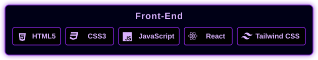

  <h2>👋 Olá! Sou um estudante de Engenharia de Computação</h3>
  
Apaixonado por transformar dados em soluções e ideias em código.

  
  

    
    
    
  

  <h2>🛠️ Tecnologias e Ferramentas</h2>

  

  

  

  <h2>📈 Estatísticas de Desenvolvedor</h2>
  
  

## 📫 Vamos conversar?

  
  
  

 

  <i>"O sucesso é o acúmulo de pequenos esforços repetidos dia após dia."</i>

